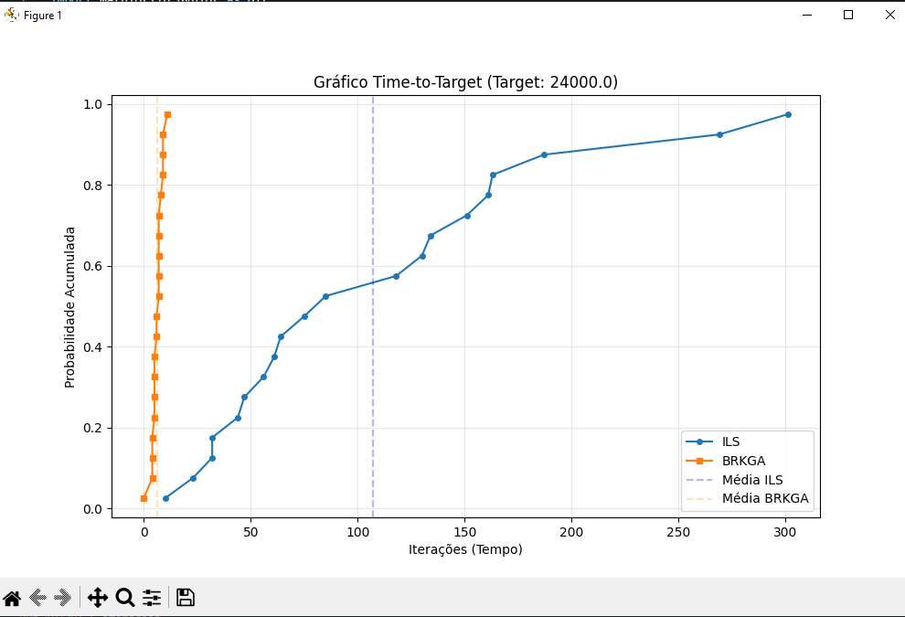

# Modelagem formal do Problema

## Problema do Caixeiro Viajante com Coleta e Entrega (PDTSP)

O Problema do Caixeiro Viajante com Coleta e Entrega (PDTSP) é uma extensão do clássico problema de otimização combinatória TSP. No PDTSP, o objetivo é encontrar a rota de custo mínimo para um veículo que deve atender a um conjunto de requisições de transporte. Cada requisição é composta por um nó de **origem (coleta)** e um nó de **destino (entrega)**.

A modelagem matemática implementada neste projeto considera:

* **Grafo de Cidades:** Um conjunto de $N$ cidades com localizações geográficas conhecidas.
* **Matriz de Custos:** Distâncias euclidianas calculadas entre todos os pares de cidades $(i, j)$.
* **Restrições de Precedência:** Para cada par $(pickup, delivery)$, o nó de coleta deve obrigatoriamente preceder o nó de entrega na sequência de visitação.
* **Função Objetivo:** Minimizar a soma total das distâncias percorridas, garantindo o retorno ao depósito inicial (nó 0).
* **Tratamento de Inviabilidade:** Devido à complexidade das restrições, adotou-se uma técnica de **penalização**. Rotas que violam a ordem de precedência recebem um custo punitivo de $9.999.999,00$, garantindo que algoritmos de busca descartem soluções inválidas em favor de rotas viáveis.

# Metaheuríticas

As metaheurísticas são estratégias de alto nível para busca estocástica que visam encontrar soluções satisfatórias para problemas de alta complexidade em tempo computacional aceitável. Neste trabalho, focamos no equilíbrio entre **intensificação** (refinamento de ótimos locais) e **diversificação** (exploração de novas áreas do espaço de busca).

Para lidar com o PDTSP, adaptamos os algoritmos para superar o "bloqueio" das restrições de precedência, que tornam o espaço de busca altamente desconexo. Foram implementadas duas abordagens distintas:

## Metaheurística A: Iterative Local Search (ILS)

> O algoritmo de Busca Local Iterativa (ILS) é uma meta-heurística baseada em trajetória que opera sob o princípio de que uma busca local pode ser significativamente melhorada se aplicada repetidamente a partir de pontos de partida modificados (perturbados).

- Projetado para escapar de ótimos locais ao alternar entre fases de **intensificação** (busca local) e **diversificação** (perturbação).

### Mecanismo de Busca

> Diferente de algoritmos populacionais que mantêm diversos indivíduos, o ILS foca no refinamento sucessivo de uma única solução de referência, realizando saltos estratégicos no espaço de busca discreto (permutações de cidades).

- **Intensificação:** Utiliza o procedimento de *Hill Climbing* com o operador de *Swap* para explorar a vizinhança imediata e convergir para o melhor ponto possível em uma região específica.
- **Diversificação:** Aplica uma perturbação estocástica sobre a melhor solução encontrada para "saltar" para uma nova região, evitando que o algoritmo fique preso em vales de otimalidade local.

### Componentes e Operadores

> A implementação estrutura-se em métodos que garantem a validade das soluções perante as restrições de precedência e a eficiência da exploração.

- **A. Hill Climbing (Busca Local):**
  - Realiza um número fixo de iterações (`n_local_iter`) para refinar a rota atual.
  - **Operador de Movimento:** Seleciona duas cidades aleatoriamente e troca as suas posições na rota (*Swap*).
  - **Critério de Aceitação:** A troca só é mantida se o novo custo for inferior ao custo atual, garantindo uma estratégia de descida. Caso contrário, a troca é revertida para preservar o estado anterior.
- **B. Perturbação (Advance):**
  - É o mecanismo de escape do algoritmo. Ele gera um novo ponto de partida aplicando `p_size` trocas aleatórias à melhor solução global atual.
  - Este processo "desestabiliza" a solução ótima local para permitir que o algoritmo explore novas regiões que não seriam alcançadas apenas por melhorias incrementais.
- **C. Construção de Rota Válida (Initialize):**
  - Para evitar a penalização de custo infinito do PDTSP, o método de inicialização constrói uma rota lógica: adiciona primeiro todas as cidades de coleta (`pickups`) e, posteriormente, todas as cidades de entrega (`deliveries`).
  - Garante que a busca comece dentro do espaço de soluções viáveis, permitindo a evolução real do custo desde a primeira iteração.

### Framework

> O algoritmo opera seguindo um ciclo lógico e iterativo estruturado em passos bem definidos:

1. **Inicialização:** Constrói uma rota válida respeitando as precedências e define-a como a melhor solução inicial (`best_solution`).
2. **Avaliação Inicial:** Calcula o custo real da rota através do método `evaluate` do problema, estabelecendo o primeiro recorde.
3. **Perturbação:** Aplica uma mudança estocástica (trocas aleatórias) na melhor solução para gerar um novo ponto de partida (`perturbed_tour`).
4. **Refinamento:** Executa o `hillclimbing` a partir deste novo ponto para encontrar o ótimo local daquela nova região.
5. **Atualização do Incumbente:** Se o resultado da busca local for superior (menor custo) à melhor solução global registrada, a `best_solution` e seu custo são atualizados.
6. **Repetição:** O ciclo de perturbação e busca local continua até que a regra de parada (`termination`), baseada no número máximo de iterações, seja satisfeita.

## Metaheurítica B: Biased Random-Key Genetic Algorithm (BRKGA)

> O Algoritmo Genético de Chaves Aleatórias Enviesado (BRKGA) é uma meta-heurística de alto nível inspirada no princípio de Darwin de sobrevivência do mais apto.

- Projetado para encontrar soluções de alta qualidade para problemas complexos de otimização combinatória e contínua.

### Busca Indireta

> Diferente dos algoritmos genéticos tradicionais que operam diretamente nas soluções do problema, o BRKGA utiliza uma busca indireta no espaço de chaves aleatórias.

- **Codificação:** Cada indivíduo (solução) é representado como um cromossomo composto por uma sequência de **N** números reais (chaves aleatórias) gerados no intervalo contínuo [0,1).
- **Decodificador:** 
  - Recebe o vetor de chaves aleatórias como *input*.
  - Transforma esse vetor em uma solução viável para o problema real como *output*.
  - Calcula o custo ou *fitness* da solução gerada.

### Dinâmica Evolutiva e População

> A cada geração K, o algoritmo avalia todos os indivíduos e divide a população de tamanho P em dois grupos distintos com base em seus custos: soluções elite (as melhores) e soluções não-elite.

A transição para a próxima geração (**K+1**) acontece por causa desses processos:

- **A. Estratégia Elitista:** As melhores soluções da geração atual (o conjunto elite) são copiadas diretamente e sem alterações para a próxima geração.
  - Garante a preservação do *incumbent* (a melhor solução encontrada até o momento nunca é perdida).
- **B. Introdução de Mutantes:** Um número fixo de mutantes é gerado aleatoriamente e inserido diretamente na nova população.
  - Permite que o algoritmo escape de ótimos locais.
  - BRKGA não aplica mutação durante o cruzamento, mas sim através da inserção desses novos indivíduos.
- **C. Cruzamento Enviesado:** O restante da nova população é preenchido através do cruzamento de dois progenitores da geração anterior.
  - **Seleção de Pais:** Um dos pais é sempre selecionado aleatoriamente do conjunto elite, enquanto o outro é escolhido ao acaso de toda a população atual.
  - **Viés de Herança:** Para cada gene (chave), o descendente tem uma probabilidade maior que 0,5 (geralmente 0,7) de herdar a chave do pai elite.
    - Faz com que os filhos tenham mais chances de herdar as características das melhores soluções encontradas.

### Framework

> O algoritmo opera seguindo um ciclo lógico e iterativo estruturado em passos bem definidos:

1. **Inicialização:** Gera **P** vetores de chaves aleatórias iniciais.
2. **Decodificação:** Converte cada vetor em uma solução real e calcula seu respectivo custo.
3. **Ordenação:** Classifica os indivíduos do melhor para o pior com base no custo.
4. **Evolução:** Aplica a cópia elite, gera mutantes e realiza o cruzamento enviesado para formar a nova população.
5. **Repetição:** O ciclo continua até que uma regra de parada seja satisfeita.

# Experimentos Computacionais
> Para avaliar o desempenho e a robustez das metaheurísticas implementadas, foram realizados testes numéricos utilizando o problema. Os experimentos focam em analisar tanto a velocidade de convergência quanto a qualidade das soluções em relação a alvos preestabelecidos.
## Metodologia de Teste
> Os algoritmos foram executatos individualmente para garantir a confiabilidade estatística
## Análise Time-To-Target
> O script ttt_experiment.py gerou as curvas de probabilidade para ambas as metaheurísticas, buscando o alvo fixado em *24.000,00*.

### Interpretação dos Resultados

A análise do gráfico revela comportamentos distintos entre as duas abordagens:

1. **Iterative Local Search (ILS):** - Demonstra uma convergência significativamente mais rápida, com a curva de probabilidade acumulada subindo de forma íngreme logo nas primeiras centenas de iterações.
   - Em 100% das execuções, o ILS atingiu o alvo antes de completar 500 iterações.
   - Isso indica que a estratégia de **intensificação** (Hill Climbing) combinada com a inicialização válida é extremamente eficaz para esta escala de problema.

2. **Biased Random-Key Genetic Algorithm (BRKGA):**
   - Apresenta uma curva deslocada para a direita, indicando que necessita de um número maior de gerações para atingir o mesmo patamar de custo.
   - A inclinação mais suave sugere uma maior variância no tempo de descoberta do alvo, com a convergência total (100%) ocorrendo após a iteração 1.500.
   - Este comportamento é típico de algoritmos populacionais, que priorizam a **diversificação** e exploração global antes de concentrar a população em regiões de ótimo.

> O ILS demonstrou ser altamente eficiente para esta instância, pois sua fase de intensificação (Hill Climbing) consegue refinar rapidamente a solução inicial válida. A estratégia de perturbação garantiu que o algoritmo não ficasse estagnado, superando a velocidade de convergência do BRKGA

## Comparação com BKS
O ILS atingiu o melhor custo de **18.216,69**, demonstrando alta eficácia. Ambos os algoritmos foram robustos ao lidar com as restrições de coleta e entrega graças aos mecanismos de inicialização e reparo implementados.